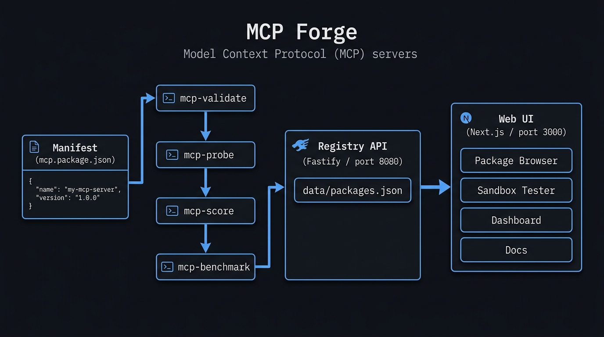
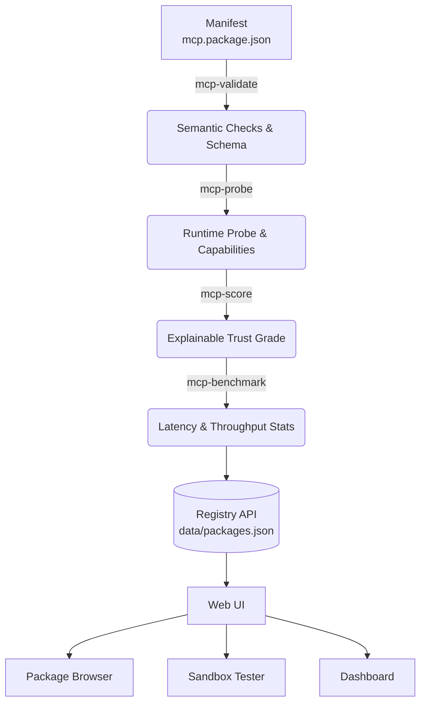
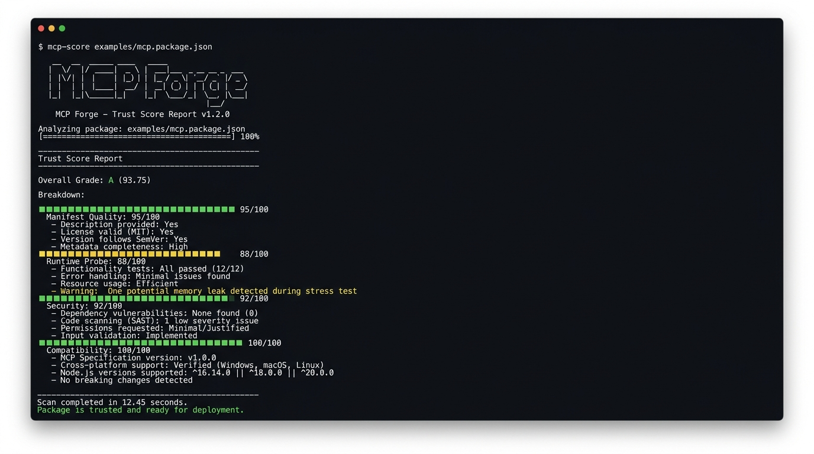

<div align="center">
  <h1>🛠️ MCP Forge</h1>
  <p><strong>The trusted operating layer for Model Context Protocol (MCP) servers.
</strong></p>
  <p>🔗 <a href="https://luv-goel.github.io/MCP-Forge">https://luv-goel.github.io/MCP-Forge</a></p>
  <p>Discover, validate, score, benchmark, sandbox-test, and install MCP servers with absolute confidence.</p>
  
  [](https://opensource.org/licenses/MIT)
  [](#)
  [](CONTRIBUTING.md)
</div>

<br/>



---

## 📖 Table of Contents

- [Overview](#-overview)
- [Key Features](#-key-features)
- [Architecture & Data Flow](#-architecture--data-flow)
- [Getting Started](#-getting-started)
- [CLI Toolchain](#-cli-toolchain)
- [Registry API](#-registry-api)
- [Security Model](#-security-model)
- [Contributing](#-contributing)
- [License](#-license)

---

## 🌟 Overview

MCP Forge is a professional platform and toolchain designed for the **Model Context Protocol** ecosystem. It provides the infrastructure needed to turn the growing world of MCP servers into a verified, scored, and securely installable registry. 

Whether you are an MCP server developer looking to validate your work, or an organization wanting to safely deploy third-party MCP agents, Forge provides the guardrails and runtime tooling you need.

---

## ✨ Key Features

- 🛡️ **Trust Infrastructure** — Real manifest validation against the official schema, runtime probing, explainable trust scoring, and deep security analysis.
- ⚡ **Runtime Tooling** — Benchmark latency and throughput against live servers, and sandbox-test JSON-RPC calls securely.
- 🔄 **Live Polling** — Use `mcp-watch` for real-time manifest validation during development.
- 🔌 **Universal Compatibility** — Generate ready-to-use install configs for Claude Desktop, OpenAI-compatible clients, VS Code, and Docker Compose.
- 🌐 **Registry API + Web UI** — A durable JSON-backed registry with powerful search, dynamic filters, pagination, release management, and a beautiful Next.js package browser.

---

## 🏗️ Architecture & Data Flow



---

## 🚀 Getting Started

### Prerequisites

- Python 3.10+
- Node.js 20+
- Optional: Docker (for container-based servers)

### Installation

1. **Clone the repository:**
   ```bash
   git clone https://luv-goel.github.io/MCP-Forge.git
   cd MCP-Forge
   ```

2. **Install dependencies:**
   ```bash
   # Python core tools
   pip install -r requirements.txt
   
   # Node services
   cd apps/api && npm install && cd ../..
   cd apps/web && npm install && cd ../..
   ```

3. **Launch the platform:**
   ```bash
   # Start the registry API (port 8080)
   cd apps/api && npm run dev
   
   # Start the web app (port 3000)
   cd apps/web && npm run dev
   ```
   Open `http://localhost:3000` to access the Web UI.

---

## 🧰 CLI Toolchain

Forge comes with a comprehensive suite of CLI tools for developers and CI/CD environments.



```bash
# Validate a manifest against the official schema
python cli/bin/mcp-validate examples/mcp.package.json

# Watch a manifest for changes and validate in real-time (NEW)
python cli/bin/mcp-watch examples/mcp.package.json --interval 2

# Probe a server's runtime (launches it and sends initialize)
python cli/bin/mcp-probe examples/echo-server.mcp.package.json

# Compute an explainable trust score
python cli/bin/mcp-score examples/mcp.package.json

# Benchmark a live server (latency percentiles + throughput)
python cli/bin/mcp-benchmark examples/echo-server.mcp.package.json --iterations 200

# Run security policy analysis (scopes, SSRF, docker hygiene)
python cli/bin/mcp-security examples/mcp.package.json

# Generate install configs for supported clients
python cli/bin/mcp-generate examples/mcp.package.json --output-dir ./configs
```

*Tip: All tools support the `--output/-o` flag to write structured JSON reports.*

---

## 🔌 Registry API

The Registry API (`http://localhost:8080`) provides a durable store for MCP packages and releases.

| Endpoint | Method | Description |
|----------|--------|-------------|
| `/v1/packages` | `GET` | List packages (supports `q`, `transport`, `auth` filters) |
| `/v1/packages/:slug` | `GET` | Get package details |
| `/v1/packages` | `POST` | Register a new package |
| `/v1/packages/:slug/releases` | `POST` | Publish a new release |
| `/v1/packages/:slug/trust` | `GET` | Compute live trust score |
| `/v1/packages/:slug/install`| `GET` | Generate installation configs |

---

## 🔒 Security Model

MCP Forge prioritizes the safe execution of third-party model context servers:

- **Scope Analysis:** Flags unbounded filesystem paths, unrestricted network egress, and overly broad wildcard patterns.
- **SSRF Detection:** Warns on known Server-Side Request Forgery testing endpoints in egress domains.
- **Egress Hooks:** Utilizes `channel_egress_hook.py` for layer-7 allowlist/denylist enforcement with full JSONL audit logging.
- **Sandbox Isolation:** Employs subprocess isolation with strict per-request lifetimes during sandbox testing.

For detailed security procedures or to report a vulnerability, please see our [Security Policy](SECURITY.md).

---

## 🤝 Contributing

We welcome contributions! Please see our [Contributing Guide](CONTRIBUTING.md) to learn how you can help build the future of the MCP ecosystem. 

1. Fork the Project
2. Create your Feature Branch (`git checkout -b feat/AmazingFeature`)
3. Commit your Changes (`git commit -m 'feat: Add some AmazingFeature'`)
4. Push to the Branch (`git push origin feat/AmazingFeature`)
5. Open a Pull Request

---

## 📄 License

This project is licensed under the MIT License - see the [LICENSE](LICENSE) file for details.

<div align="center">
  <sub>Built with ❤️ by Luv Goel</sub>
</div>
